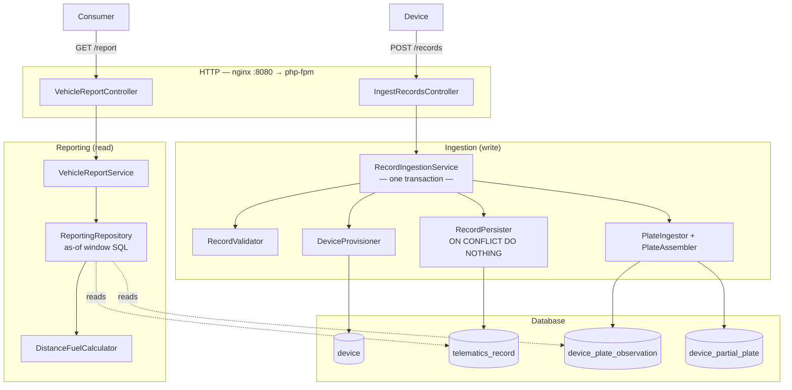
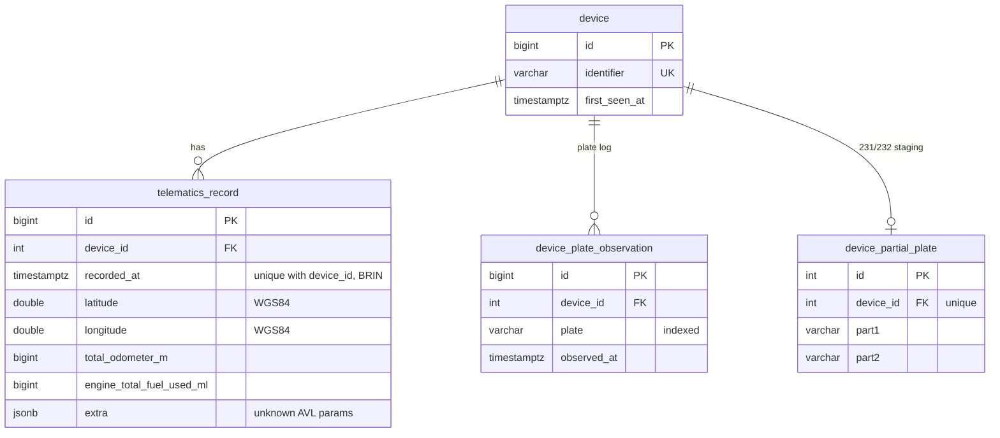

# Telematics Ingestion & Reporting API

A telematics data ingestion API that receives GNSS + AVL batches from transport
devices (Teltonika FMC650), stores them at scale, and exposes an open reporting
endpoint returning **distance travelled** and **fuel consumed** for a vehicle
over any time range.

---

## Architecture



---

## Database schema



## Getting started

```bash
# 1. Build
docker compose up -d --build

# 2. Install PHP dependencies
docker compose exec app composer install

# 3. Create the databases and run migrations (dev + test)
docker compose exec app php bin/console doctrine:database:create --if-not-exists
docker compose exec app php bin/console doctrine:database:create --if-not-exists --env=test
docker compose exec app php bin/console doctrine:migrations:migrate -n
docker compose exec app php bin/console doctrine:migrations:migrate -n --env=test

# 4. Verify
curl http://localhost:8080/health
# {"status":"ok"}
```

## API

### `POST /api/v1/telematics/records`

Request

```jsonc
{
  "device": "356938035643809",
  "records": [
    {
      "timestamp": 1781849860.548,
      "lat": 40.17,
      "lon": 44.49,
      "altitude": 990,
      "io": {
        "24": 54, // speed (km/h)
        "239": 1, // ignition (0 / 1)
        "216": 123456, // total odometer (metres)
        "86": 7890, // engine total fuel used (mL)
        "231": "AB", // registration plate — part 1
        "232": "123CD" // registration plate — part 2
      }
    },
    {
      "timestamp": 1781849861.548,
      "io": {
        "216": 123680, // odometer
        "86": 7910 // fuel used
      }
    }
  ]
}
```

```bash
curl -X POST http://localhost:8080/api/v1/telematics/records \
  -H 'Content-Type: application/json' \
  -d '{
    "device": "356938035643809",
    "records": [
      {
        "timestamp": 1781849860.548,
        "lat": 40.17,
        "lon": 44.49,
        "altitude": 990,
        "io": { "24": 54, "239": 1, "216": 123456, "86": 7890, "231": "AB", "232": "123CD" }
      },
      {
        "timestamp": 1781849861.548,
        "io": { "216": 123680, "86": 7910 }
      }
    ]
  }'
```

**`200 OK`** — a per-batch summary. Valid records are stored; invalid ones are
quarantined into `rejected` (the batch is never rejected wholesale):

```json
{
  "received": 2,
  "stored": 2,
  "duplicates": 0,
  "rejected": []
}
```

`duplicates` counts records already present — resends are idempotent. A malformed
record appears as `{ "index": 3, "reason": "missing or invalid timestamp" }`.

**`400`** malformed JSON, or a missing/blank/
oversized `device`, or a non-list `records`.

### `GET /api/v1/vehicles/{registrationNumber}/report`

Query parameters `from` and `to` are ISO-8601 datetimes (half-open)
`[from, to)`.

```bash
curl "http://localhost:8080/api/v1/vehicles/AB123CD/report?from=2026-01-01T00:00:00Z&to=2027-01-01T00:00:00Z"
```

**`200 OK`**:

```json
{
  "registrationNumber": "AB123CD",
  "from": "2026-01-01T00:00:00+00:00",
  "to": "2027-01-01T00:00:00+00:00",
  "distanceKm": 12.4,
  "fuelLitres": 1.8,
  "fuelPer100Km": 14.52
}
```

- **`404`** — the plate was never observed.
- **`400`** — missing/invalid `from`/`to`.

### `GET /health`

```json
{ "status": "ok" }
```

## Testing & quality

```bash
# Unit + functional
docker compose exec app php bin/phpunit

# Static analysis
docker compose exec app composer stan
docker compose exec app composer cs
```

---

## Design choices / limitations:
- Records belong to the _device_, not the vehicle;
- invalid records are returned in the response but not added to the dead-letter queue;
- time-based partitioning not built.
